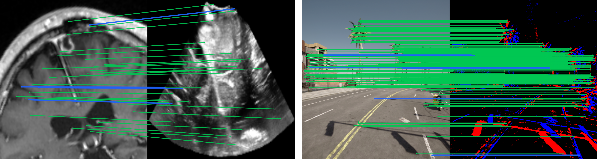

<h1 align="center">CrossFeat</h1>

<h3 align="center">Bridging Imaging Modalities in Feature Descriptor Space</h3>

<p align="center">
  Paul Schneider<sup>1,2</sup> · Nazim Haouchine<sup>1</sup><br>
  <sup>1</sup>Harvard Medical School, Brigham and Women's Hospital<br>
  <sup>2</sup>Technical University of Munich<br>
  <strong>ECCV 2026</strong>
</p>

<p align="center">
  <a href="https://arxiv.org/abs/2609.00272">Paper</a> ·
  <a href="https://paulschneider01.github.io/CrossFeat-page/">Project Page</a>
</p>

<p align="center">
  
</p>

<p align="center">
  <sub>MRI–ultrasound with SuperPoint (left), RGB–event with SIFT (right). Blue: original descriptors. Green: CrossFeat.</sub>
</p>

Official implementation of our **ECCV 2026** paper. CrossFeat adapts local
descriptors across imaging modalities by translating appearance while preserving
geometry, without retraining the original descriptor.

## Installation

Python 3.11. CUDA recommended for training.

```bash
git clone https://github.com/paulschneider01/CrossFeat.git
cd CrossFeat
python3.11 -m venv .venv
source .venv/bin/activate
python -m pip install --upgrade pip
python -m pip install -r requirements.txt
```

## Training

### 1. Prepare paired images

Use aligned, equal-sized image pairs with matching filenames:

```text
my_dataset/
├── train/
│   ├── modality_a/pair_001.png
│   └── modality_b/pair_001.png
├── val/
│   ├── modality_a/pair_101.png
│   └── modality_b/pair_101.png
└── test/
    ├── modality_a/pair_201.png
    └── modality_b/pair_201.png
```

Supported formats: PNG, JPEG, TIFF, NPY. Split by subject or scene.

### 2. Configure

```bash
cp config/config_example.yaml config/my_pair.yaml
```

Edit these fields in `config/my_pair.yaml`:

```yaml
name: my_pair

datasets:
  - name: paired_folders
    data_root: /path/to/my_dataset
    modalities: [modality_a, modality_b]
    pairs:
      - {source: modality_a, target: modality_b}

device: cpu  # or cuda
```

### 3. Train

```bash
python train.py --config config/my_pair.yaml
```

Model bundle (keep all three files together):

```text
experiments/crossfeat/my_pair/
├── best_model.pt
├── pca.pkl
└── config.json
```

Use a new run `name` for each experiment.

## Evaluation

```bash
python evaluate.py \
  --model_dir experiments/crossfeat/my_pair \
  --split test \
  --output_json results/my_pair.json
```

Reports Top-1/5/10 retrieval accuracy, inlier ratio (5 px), and TRE (pixels),
with aggregate and per-pair results.

## Citation

```bibtex
@inproceedings{schneider2026crossfeat,
  title     = {{CrossFeat}: Bridging Imaging Modalities in Feature Descriptor Space},
  author    = {Schneider, Paul and Haouchine, Nazim},
  booktitle = {Computer Vision -- ECCV 2026},
  pages     = {53--71},
  year      = {2026},
  doi       = {10.1007/978-3-032-37174-4_4}
}
```

## License

[MIT](LICENSE). Questions? [Open an issue](https://github.com/paulschneider01/CrossFeat/issues).
